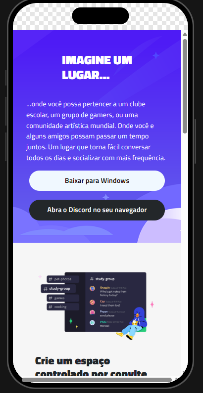
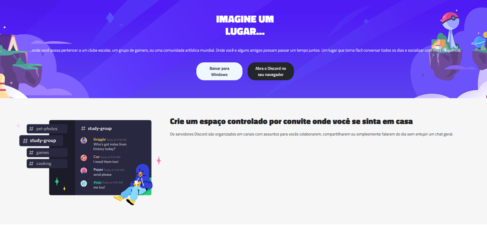

# Olá, eu sou a Wesley Santos! 👋

# Desafio de Responsividade - Página Discord

Projeto prático de Front-end focado em Responsividade com CSS, onde reproduzimos a interface da plataforma Discord com identidade visual própria. Ideal para desenvolver seu portfólio e aplicar conceitos modernos de design responsivo.

## 📸 Imagens do Projeto

### 💻 Versão Desktop

### 💻 Versão Desktop

## 🌐 Página do Projeto

Você pode visualizar o projeto publicado em:

🔗 [https://wesleysantos0.github.io/responsividade-discord](https://wesleysantos0.github.io/responsividade-discord)

---

## 📈 Ajustes e melhorias

O projeto está em evolução contínua. Futuras melhorias incluem:

- [ ] Ajustar animações para transições suaves  
- [ ] Refatorar código para melhor organização  
- [ ] Adicionar tema escuro  
- [ ] Inserir validação de formulário (se houver)  
- [ ] Implementar acessibilidade (a11y)  

---

## 💻 Pré-requisitos

Antes de iniciar, certifique-se de que você possui:

- ✅ Navegador atualizado (Chrome, Firefox, Edge)  
- ✅ Editor de código como [VSCode](https://code.visualstudio.com/)  
- ✅ Conhecimento básico de HTML e CSS  
- ✅ Link de referência ao protótipo no [Figma](https://www.figma.com/design/NRBYrG5d4DSzObv7dpTqoM/Desafio-Responsividade---DIO?t=U33G5e7BHIqEvHsG-0)   

---

## Melhorias

O projeto está em evolução contínua. Futuras melhorias incluem:

 Ajustar animações para transições suaves

 Refatorar código para melhor organização

 Adicionar tema escuro

 Inserir validação de formulário (se houver)

 Implementar acessibilidade (a11y)
## Autores

- [@DIO](https://web.dio.me)

